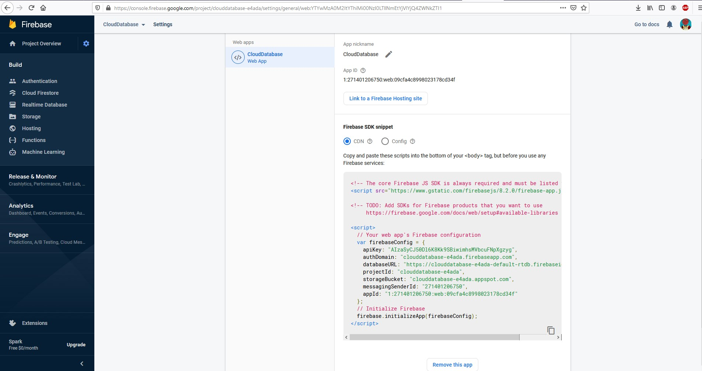
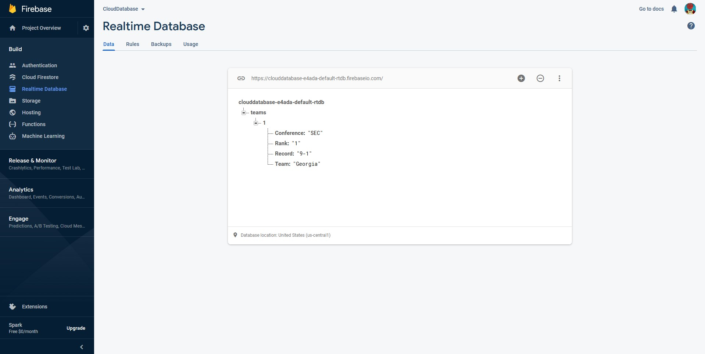

# Cloud Database

Author, Conner Pohlsander

## Overview

Yet again, I have decided to do a college football related project. In this project I will be using a Cloud Database connected to a website to allow the user to be able to add rankings to the database and modify them if needs be.

## Development Environment

* Visual Studio Code
* Node.js
* Google Firebase

Before any of the following steps are to be taken, first a project and database need to be set up on [Google Firebase](https://console.firebase.google.com/). Then [node.js](https://nodejs.org/en/) needs to be downloaded for the environment to work correctly.

## Execution

The first step is to make a folder linked to a repository on GitHub and then create an HTML file in VS Code. The first thing to do is add code to make the box inputs and buttons appear that are needed to submit the data to the database through the website. This code will accomplish that:

```
    Rank  <input id="rankbox" type="text"></input> <br><br>
    Team     <input id="teambox" type="text"></input> <br><br>
    Conference <input id="conbox" type="text"></input> <br><br>
    Record   <input id="recbox" type="text"></input> <br><br>
    <br><br>
    <button id="insert">INSERT</button>
    <button id="select">SELECT</button>
    <button id="update">UPDATE</button>
    <button id="delete">DELETE</button>
    <br><br>
```

The ids will come in handy later.

The next step is to add the scripts needed for the database created to link to the HTML file just made. First these scripts need to be added:
```
    <script src="https://www.gstatic.com/firebasejs/8.2.0/firebase-app.js"></script>
    <script src="https://www.gstatic.com/firebasejs/8.2.0/firebase-auth.js"></script>
    <script src="https://www.gstatic.com/firebasejs/8.2.0/firebase-database.js"></script>
```

Next a web app will need to be created in your project. To do that, go the project settings and then add web app. After creating the web app you then need to copy the code given to you, since this will link your project to the HTML file. 



Once that is completed, the following code will set up the rest of what we need to make the website fully functional:

```
    <script> 
      var rankV, teamV, conV, recV;

      //assign variables to functions
      function Ready(){
              rankV = document.getElementById('rankbox').value;
              teamV = document.getElementById('teambox').value;
              conV = document.getElementById('conbox').value;
              recV = document.getElementById('recbox').value;
          }
```

Once that is done, the code for the JavaScript code for the buttons can be added. We'll start with adding the code for the insert button. It looks as follows:

```
    document.getElementById('insert').onclick = function(){
          Ready();
          firebase.database().ref('teams/'+rankV).set({
            Rank: rankV,
            Team: teamV,
            Conference: conV,
            Record: recV
          });
        }
```

Click on your Realtime Database in Firebase and look at the data section. It should look like this after you've added some data through using your website:




## Helpful Links

* [Firebase Documentation](https://firebase.google.com/docs/database)
* [https://www.youtube.com/watch?v=oxqVnWPg0So&list=LL&index=1](https://www.youtube.com/watch?v=oxqVnWPg0So&list=LL&index=1)
* [https://stackoverflow.com/questions/44452392/show-firebase-data-in-a-html-table-with-javascript](https://stackoverflow.com/questions/44452392/show-firebase-data-in-a-html-table-with-javascript)
